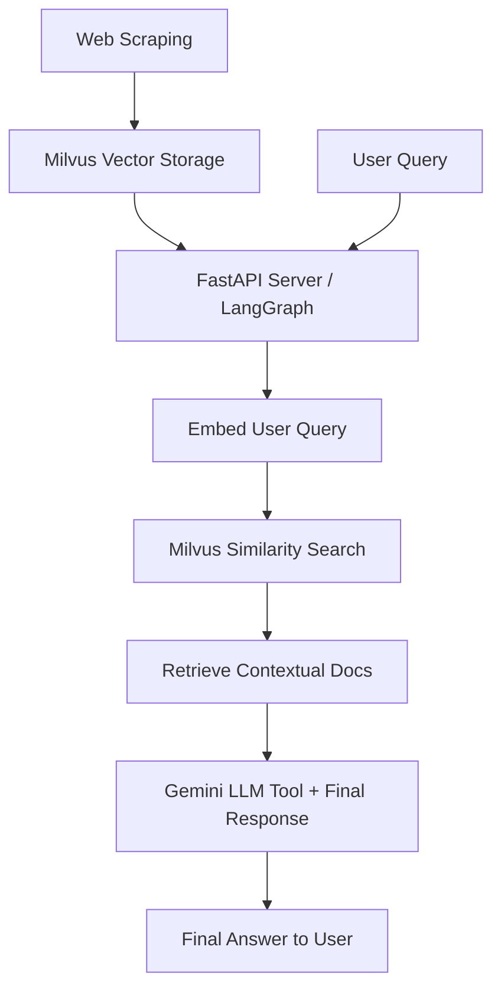

# 🧠 RAG-Powered Restaurant Chatbot with LangGraph, Milvus, and Gemini

## YouTube Demonstration

🎬 **Demo Video**  
*Click on the image to watch the walkthrough.*

[](https://youtube.com/your-video-link)


## ✨ Features

- **Web Scraping**: Collects restaurant websites (HTML, text, images)
- **Embedding Pipeline**: Sentence-transformers (MiniLM) used for vectorization
- **Vector Storage**: Milvus (self-hosted or Zilliz Cloud) for fast similarity search
- **Retrieval-Augmented Generation (RAG)**: Injects real-time context into LLM responses
- **LangGraph + FastAPI Backend**: Memory-aware, dynamic RAG flow served over REST API
- **Gemini 2 Flash LLM**: Smart conversational agent with tool-calling capability
- **In-Memory LangGraph Checkpointing**: Retains short-term memory across steps
- **Google Colab Ready**: Train embeddings and scrape data easily!


## 📸 Screenshots

|  |  |
| -------------------------- | -------------------------- |

|  |
| --------------------------------------------------- |

|  |
| --------------------------------------------------- |

|  |
| --------------------------------------------------- |

|  |  |
| -------------------------- | -------------------------- |

|  |  |
| -------------------------- | -------------------------- |


## 🏗️ Architecture




## 🛠️ Components

| Layer                | Technology               |
| -------------------- | ------------------------ |
| Web Scraping         | BeautifulSoup, Requests  |
| Embedding Generator  | HuggingFace MiniLM-L6-v2 |
| Vector DB            | Milvus/Zilliz Cloud      |
| Backend Server       | FastAPI + LangGraph      |
| Memory Management    | LangGraph MemorySaver    |
| Large Language Model | Google Gemini-2 Flash    |


## 📂 Folder Structure

```
.
├── .venv/                  # Virtual environment
├── app/
│   ├── graph.py            # LangGraph RAG Workflow
│   ├── prompts.py          # System prompts for LLM
│   └── server.py           # FastAPI Server
├── assets/                 # Static assets (optional)
├── .env                    # Environment Variables
├── .gitignore              # Git ignored files
├── langgraph.json          # LangGraph configuration
├── README.md               # This file
├── requirements.txt        # Python dependencies
├── Training.ipynb          # Web Scraping + Embedding (Google Colab Notebook ✅)
└── ui.py                   # (Optional) Local UI Script
```


## ⚙️ Setup Instructions


### Scrape and Embed Data Easily (Google Colab )

You can directly use the `Training.ipynb` file provided!

- Upload `Training.ipynb` into [Google Colab](https://colab.research.google.com/).  
- Run all cells — it will automatically scrape restaurant websites, generate embeddings, and store them into Milvus!  
- No local setup required — just **paste, run, and enjoy** 

> **Important:** Have your **Milvus URI** and **Milvus Token** ready when running.

### Setup Local Server (Fast API )

1. **Clone Repository**

```bash
https://github.com/umeshSinghVerma/Genai.git
cd Genai
```

2. **Install Dependencies**

```bash
pip install -r requirements.txt
```

3. **Prepare Environment**

Create a `.env` file:

```ini
MILVUS_URI=your_cluster_uri
MILVUS_TOKEN=your_cluster_token
GOOGLE_API_KEY=your_google_api_key
```

4. **Run the Server**

```bash
cd app
python server.py
```

Server will start at `http://localhost:8000`

5. **Run the Frontend**

```bash
cd ..
streamlit run ui.py
```

Frontend will start at `http://localhost:8501`


## ⚡ Prerequisites

- Python 3.9+
- Milvus/Zilliz Cloud account
- Google API Key for Gemini model


## 🤝 Contributing

- Fork this repository
- Create a feature branch (`git checkout -b feature/your-feature`)
- Commit your changes (`git commit -am 'Added feature'`)
- Push to GitHub (`git push origin feature/your-feature`)
- Open a Pull Request


## 📜 License

This project is licensed under the [MIT License](LICENSE).


## 🙏 Acknowledgements

- [Milvus](https://milvus.io/)
- [LangGraph](https://github.com/langchain-ai/langgraph)
- [HuggingFace](https://huggingface.co/)
- [Google Gemini Models](https://cloud.google.com/vertex-ai/docs/generative-ai/learn/models)


# 🎯 Project Purpose Summary:

- **Goal**: Build an intelligent restaurant chatbot that uses real-time knowledge from restaurant websites.
- **Method**: Embed scraped data → Store embeddings in Milvus → Retrieve relevant chunks → Feed into Gemini model via LangGraph → Return a user-friendly answer.
- **Why LangGraph?**: Handles **tool calling**, **memory management**, and **step-wise LLM workflows** easily.

