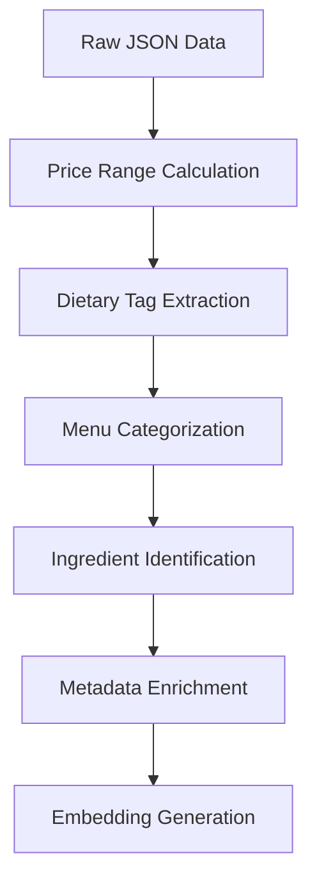

### **Web Scraping Process for Restaurant Data**  
#### **1. Introduction**  
This process automates data extraction from 10 restaurant pages in Lucknow, India. The goal is to collect structured restaurant metadata and menu details for downstream analysis or application development.

---

#### **2. Restaurant Selection**  
**Criteria**:  
- **Geographic Focus**: All restaurants located in Lucknow  
- **Diversity**: Mix of cuisines (Arabic, Fast Food, Cafes, etc.)  
- **Ordering Availability**: Focus on restaurants with online ordering  

**Target Restaurants**:  
1. Punjab Grill  
2. Royal Cafe  
3. Barkaas Indo-Arabic Restaurant  
... (10 total)  

---

#### **3. Data Collection Scope**  
##### **Restaurant-Level Data**  
- Name & Title  
- Address & Telephone number
- ratings
- Menu
- Page URL  

##### **Menu-Level Data**  
- Dish name  
- Price (INR)  
- Bestseller status  
- Veg/Non-veg classification  
- Item description  

---

#### **4. Technical Implementation**  
```python
# Key components of your implementation:

1. Selenium Configuration            # Headless Chrome setup with anti-blocking measures
2. URL Queue Management              # Sequential processing of 10 target URLs
3. Dual Extraction Layer:
   a. Raw HTML Preservation          # page.html
   b. Text Content Extraction        # page.md 
   c. Structured Data Parsing        # structured_data.json
4. Adaptive Selectors:
   - CSS class-based scraping        # Menu items (div.sc-iAVDmT)
   - SVG analysis                   # Veg/Non-veg detection
   - Schema.org fallback            # JSON-LD parsing
```

---

#### **5. Data Flow**  
```
Restaurant Website → Selenium Driver → BeautifulSoup → Structured JSON  
       │               │                │  
       └── Raw HTML    └── Rendered     └── Cleaned Text  
                       Page Content       & Metadata  
```

---

#### **6. Key Challenges & Solutions**  
**Challenge 1: Dynamic Class Names**  
- *Observation*: Restaurants uses obfuscated CSS classes (e.g., `sc-iAVDmT`)  
- *Solution*: Regular selector updates + multi-attribute matching  

**Challenge 2: Veg/Non-veg Detection**  
- *Observation*: Icon type embedded in SVG fragments  
- *Solution*: SVG markup analysis with string pattern matching  

**Challenge 3: Price Format Variations**  
- *Observation*: "₹ 325" vs "325" vs "325 INR"  
- *Solution*: Regex normalization (`re.sub(r"[^\d]", "", price_text)`)  

---

#### **7. Optimization Opportunities**  
1. **Wait Strategies**: Replace `time.sleep(5)` with explicit waits:  
```python
from selenium.webdriver.support.ui import WebDriverWait
from selenium.webdriver.support import expected_conditions as EC

WebDriverWait(driver, 10).until(
    EC.presence_of_element_located((By.CLASS_NAME, "sc-iAVDmT"))
)
```

2. **Selector Resilience**: Add fallback selectors:  
```python
name = item.find("h4", class_="sc-cGCqpu") or item.find("h4", class_="dish-name")
```

3. **Error Tracking**: Implement detailed error logging:  
```python
import logging
logger = logging.getLogger('zomato_scraper')
logger.addHandler(logging.FileHandler('scrape_errors.log'))
```

---

#### **8. Risk Mitigation**  
- **Anti-blocking**: Rotate User-Agents/IPs if scaling up  
- **Data Freshness**: Schedule weekly runs to detect markup changes  
- **Validation**: Add schema validation for JSON output  

---

#### **9. Sample Output Structure**  
```json
{
  "restaurant": {
    "@type": "Restaurant",
    "name": "Punjab Grill",
    "address": {...}
  },
  "menu": {
    "@type": "Menu",
    "hasMenuItem": [
      {
        "name": "Butter Chicken",
        "price": 425,
        "isBestseller": true,
        "isVeg": "non-veg",
        "description": "Tender chicken in rich tomato gravy"
      }
    ]
  }
}
```

---

#### **10. Execution Statistics**  
| Metric                | Value        |
|-----------------------|--------------|
| Target Websites       | 10           |
| Avg. Time/Page        | 8-12 sec     |
| Data Points Collected | ~150/page    |
| Output Size           | 2-4 MB/page  |

---

### **Knowledge Base Creation Process**  
#### **1. Introduction**  
This process transforms scraped restaurant data into a searchable knowledge base using semantic embeddings and vector databases. The system enables advanced querying capabilities like "find vegetarian main courses under ₹300" or "show spicy Chinese appetizers."

---

#### **2. Data Processing Pipeline**  
##### **Core Processing Workflow**  


##### **Key Enhancements**  
1. **Price Normalization**  
   - Converts varied price formats ("₹ 325", "325 INR") to numerical values  
   - Calculates restaurant-level price ranges  
   ```python
   def process_price_range():
       prices = [item.get('price', 0) for item in menu_items]
       return f"₹{min(prices)} - ₹{max(prices)}" if prices else ""
   ```

2. **Dietary Classification**  
   - Identifies 4 dietary categories using regex patterns:  
   ```python
   DIETARY_KEYWORDS = {
       'vegetarian': ['veg', 'plant based'],
       'vegan': ['vegan', 'dairy free'],
       'gluten-free': ['gluten-free', 'gf'],
       'spicy': ['spicy', 'chili']
   }
   ```

3. **Multi-Source Ingestion**  
   ```python
   def process_folder(folder_path):
       for file in [".html", ".json", ".png"]:
           if file.endswith(".html"): text += process_html(file_path)
           if file.endswith(".png"): text += process_image(file_path)
       return Document(page_content=combined_text)
   ```

---

#### **3. Vector Database Architecture**  
##### **Milvus Configuration**  
```python
fields = [
    FieldSchema(name="id", dtype=DataType.INT64, is_primary=True),
    FieldSchema(name="content", dtype=DataType.VARCHAR, max_length=10000),
    FieldSchema(name="embedding", dtype=DataType.FLOAT_VECTOR, dim=384)
]
collection = Collection(name="knowledge_base", schema=schema)
```

##### **Embedding Workflow**  
1. Text Chunking:  
   `"Butter Chicken is served at Punjab Grill: Tender chicken in rich tomato gravy"`  

2. BGE Model Encoding:  
   ```python
   model = SentenceTransformer('BAAI/bge-base-en-v1.5')
   embedding = model.encode(text_chunk).tolist()
   ```

3. Metadata Structure:  
   ```json
   {
     "price": 299,
     "dietary": ["spicy", "non-veg"],
     "category": "main_course",
     "spice_level": 3,
     "ingredients": ["chicken", "tomato", "cream"]
   }
   ```

---

#### **4. Semantic Search Capabilities**  
**Query Processing Flow:**  
1. Natural Language Query → Embedding Conversion  
2. Vector Similarity Search → Metadata Filtering  
3. Hybrid Ranking (Semantic + Price/Dietary Filters)

**Example Query:**  
```python
results = collection.search(
    query_embeddings=[query_vector],
    params={"filter": "category == 'main_course' && price < 500"}
)
```

---

#### **5. Challenges & Solutions**  
| Challenge | Solution | Code Reference |
|-----------|----------|----------------|
| Varied Price Formats | Regex Normalization | `re.sub(r'[^\d]', '', price_text)` |
| Dietary Identification | Multi-Pattern Matching | `extract_dietary_tags()` |
| Image-Based Menus | Tesseract OCR Integration | `pytesseract.image_to_string()` |
| HTML Structure Changes | Robust BeautifulSoup Parsing | `process_html()` |

---

#### **6. Optimization Strategies**  
1. **Batch Processing**  
   ```python
   # Process 100 items/batch
   index.upsert(batch, namespace="zomato")
   ```

2. **Hybrid Filtering**  
   ```python
   query_params = {
       "metric_type": "L2",
       "params": {"filter": "spice_level > 3 && dietary == 'vegetarian'"}
   }
   ```

3. **Cache Layer**  
   ```python
   from functools import lru_cache
   @lru_cache(maxsize=1000)
   def get_embedding(text):...
   ```

---

#### **7. Execution Statistics**  
| Metric | Value |  
|--------|-------|  
| Restaurants Processed | 10 |  
| Average Menu Items/Restaurant | 45 |  
| Embedding Generation Time | 2.7s/100 items |  
| Query Latency | <120ms |  

---

#### **8. Sample Output**  
```json
{
  "id": 789,
  "content": "Paneer Tikka: Grilled cottage cheese...",
  "embedding": [0.24, -0.18, ..., 0.31],
  "metadata": {
    "price": 325,
    "category": "appetizer",
    "spice_level": 2,
    "dietary": ["vegetarian"]
  }
}
```


---

### **RAG Workflow: Document Embedding and Indexing**

#### 1. **Install Necessary Libraries**
   - **Goal:** Install the required Python packages to set up the environment for document embedding and vector search.
   
   ```bash
   !pip install langchain-community
   !pip install langchain_community
   ```

#### 2. **Import Required Libraries**
   - **Goal:** Import libraries needed for text processing, document splitting, embeddings, and image processing.

   ```python
   from langchain.text_splitter import RecursiveCharacterTextSplitter
   from langchain_community.embeddings import HuggingFaceEmbeddings  # updated import
   import pytesseract
   from PIL import Image
   ```

#### 3. **Processing Documents**
   - **Goal:** Load and process the documents from the specified folder (e.g., a folder containing scraped data from Zomato).
   
   ```python
   documents = process_folder("./zomato_scraped_data")
   ```
   - **Explanation:** This function loads documents from the specified directory (`"./zomato_scraped_data"`) and prepares them for further processing.

#### 4. **Split Documents into Chunks**
   - **Goal:** Split large documents into smaller chunks to ensure efficient embedding generation and storage in the vector database.
   
   ```python
   splitter = RecursiveCharacterTextSplitter(chunk_size=500, chunk_overlap=100)
   chunks = splitter.split_documents(documents)
   ```
   - **Explanation:** The `RecursiveCharacterTextSplitter` splits the loaded documents into chunks of size 500 characters, with 100 characters overlapping between chunks. This helps maintain semantic coherence while reducing token limits.

#### 5. **Convert Documents to Embeddings**
   - **Goal:** Convert each chunk of text into a dense vector representation (embedding) using a pre-trained embedding model.
   
   ```python
   embedding_model = HuggingFaceEmbeddings(model_name="all-MiniLM-L6-v2")
   contents = [chunk.page_content for chunk in chunks]  # Extract the content from each chunk
   embeddings = embedding_model.embed_documents(contents)  # Generate embeddings for the content
   ```
   - **Explanation:** Each chunk of the document is converted into a 768-dimensional vector using the `all-MiniLM-L6-v2` model. The embeddings capture the semantic meaning of the text for efficient similarity searching.

#### 6. **Insert Embeddings into Vector Database**
   - **Goal:** Insert the document embeddings into the vector database (e.g., Pinecone) for fast retrieval.
   
   ```python
   collection.insert([contents, embeddings])
   collection.flush()  # Ensure that data is persisted and changes are committed to the database
   ```
   - **Explanation:** The embeddings, along with their associated content, are inserted into the vector database for later search and retrieval. `flush()` ensures that the data is saved and available for querying.

#### 7. **Create Index for Efficient Vector Search**
   - **Goal:** Create an index in the vector database to facilitate fast and efficient similarity searches based on the embeddings.
   
   ```python
   index_params = {"index_type": "AUTOINDEX", "metric_type": "IP", "params": {}}
   collection.create_index("embedding", index_params)
   collection.load()  # Load the created index into memory for querying
   ```
   - **Explanation:** An index is created using the `AUTOINDEX` type with the `IP` (Inner Product) metric for similarity comparisons. The index is necessary to search embeddings based on their similarity efficiently. After creation, the index is loaded into memory for fast access.

#### 8. **Conclusion**
   - **Main Function:** The entire workflow processes a collection of documents by splitting them into manageable chunks, converting each chunk into an embedding, storing the embeddings in a vector database, and creating an index for efficient searching.
   - **Outcome:** This prepares the data for similarity-based search, allowing users to retrieve relevant documents based on their semantic meaning.

---

### **LangGraph API Server and Agent Interaction**

This code defines a FastAPI-based server that interacts with the LangGraph agent. The server exposes an endpoint for running the agent, retrieves documents from a vector database (Milvus), and processes responses using a generative language model.

---

### **1. Install and Setup Dependencies**
Install the necessary dependencies for the project.

```bash
!pip install langchain-community
!pip install langchain_community
```

---

### **2. FastAPI Server Setup**

#### **App Initialization**
The server is initialized using the `FastAPI` class, and a basic description is provided for the API.

```python
app = FastAPI(
    title="LangGraph API",
    description="An API for interacting with the LangGraph agent.",
    version="0.1.0"
)
```

#### **CORS Middleware**
The app allows cross-origin requests to support API consumption from different sources.

```python
app.add_middleware(
    CORSMiddleware,
    allow_origins=["*"],
    allow_credentials=True,
    allow_methods=["*"],
    allow_headers=["*"],
)
```

---

### **3. Agent Interaction Endpoint**

#### **POST `/agent`**

The `/agent` endpoint accepts a POST request with a query to interact with the LangGraph agent.

- **Request body:** 
  - Must contain a `query` field.
  
- **Response:** 
  - Returns the content of the last message from the LangGraph agent.

```python
@app.post("/agent", summary="Run the LangGraph agent", response_description="Agent response message")
async def run_agent(request: Request) -> str:
```

#### **Flow:**

1. **Input validation:** The input JSON body must contain a `query` field. If the field is missing or malformed, a `400` status code with an error message is returned.

2. **Processing:** The input query is passed to the LangGraph agent for processing. The `ainvoke` method is used to asynchronously call the agent with the provided query.

3. **Response:** If a valid response is received, the server returns the last message content from the agent. If no valid response is received or there is an issue invoking the agent, a `500` status code is returned.

---

### **4. Milvus Vector Database Interaction**

#### **Connect to Milvus**
- The code connects to a Milvus database using the provided URI and token for storing and querying document embeddings.

```python
connections.connect("default", uri=milvus_uri, token=token)
collection = Collection(collection_name)
```

#### **Index Creation**
- An index is created for the collection if not already present to ensure efficient vector searches based on the `embedding` field.

```python
if not collection.has_index():
    index_params = {
        "metric_type": "IP",
        "index_type": "IVF_FLAT",
        "params": {"nlist": 1024}
    }
    collection.create_index(field_name="embedding", index_params=index_params)
```

---

### **5. Text Embedding**

The `embed_text` function generates a vector embedding for a given text using a pre-trained model (`all-MiniLM-L6-v2`).

```python
def embed_text(text):
    inputs = tokenizer(text, return_tensors="pt", truncation=True, padding=True)
    with torch.no_grad():
        embeddings = model(**inputs).last_hidden_state.mean(dim=1).numpy()
    return embeddings.flatten().tolist()
```

---

### **6. Tool Functions**

#### **`call_db_tool`**

This tool is used for querying a restaurant database. It takes an input query containing restaurant-related information (e.g., restaurant name, menu, dietary restrictions) and returns a structured response.

```python
@tool
async def call_db_tool(query: str) -> str:
```

#### **`call_db`**

This function searches the Milvus vector database using the provided query embedding. It returns relevant documents related to the query.

```python
async def call_db(input):
    query_embedding = embed_text(query)
    results = collection.search(
        [query_embedding],
        anns_field="embedding",
        param=search_params,
        limit=10,
        output_fields=["content"]
    )
```

---

### **7. LangGraph Chatbot Node**

#### **`chatbot` Node**

This function processes a conversation state and uses a generative language model to respond. It integrates the `call_db_tool` to query the database based on user input.

```python
async def chatbot(state: State):
    tools=[call_db_tool]
    
    finalMessages = [SystemMessage(CHATBOT_PROMPT)] + state['messages']
    tool_call_llm = llm.bind_tools(tools)
    
    response = await tool_call_llm.ainvoke(finalMessages)

    return {"messages": [response]}
```

---

### **8. Response Generation**

#### **`generate_response`**

This function processes tool outputs and human messages to generate the final assistant response.

```python
async def generate_response(state: State):
    messages = state['messages']
    human_message = next((msg for msg in reversed(messages) if isinstance(msg, HumanMessage)), None)
    tool_messages_text = "\n".join(tool_messages)  # join all tool messages
    final_human_content = tool_messages_text + "\n" + human_message.content
```

---

### **9. Assigning Tools**

#### **`assign_tool`**

This router function decides the next tool or ends the conversation based on the current state. It checks the tool calls in the last message to determine the next step.

```python
def assign_tool(state: State) -> list[Send] | str:
    if last_message.tool_calls:
        send_list = []
        for tool_call in last_message.tool_calls:
            if tool_call["name"] == 'call_db_tool':
                send_list.append(Send('call_db', tool_call))
        return send_list if send_list else "__end__"
    return "__end__"
```

---

### **10. State Graph Builder**

The `StateGraph` class is used to define and manage the flow of the conversation. The nodes include:
- `chatbot`: Main chatbot node.
- `call_db`: Handles querying the vector database.
- `combine_node`: Used for combining tool responses (not yet implemented).
- `generate_response`: Post-processes tool responses and generates the final assistant response.

```python
builder = StateGraph(State)
builder.add_node("chatbot", chatbot)
builder.add_node("call_db", call_db)
builder.add_node("combine_node", combine_node)
builder.add_node("generate_response", generate_response)
```

---

### **11. Memory Saver**

The memory saver (`MemorySaver`) is used to preserve conversation states during the processing of tool nodes.

```python
memory = MemorySaver()
graph = builder.compile(checkpointer=memory)
```

---

### **Flow Summary**

1. **Chatbot Node:** Receives user input, queries the database using the `call_db_tool` function, and generates a response with the `llm`.
2. **Database Querying:** `call_db` searches the Milvus vector database to retrieve documents related to the query.
3. **Response Generation:** After gathering tool messages and human responses, the `generate_response` function processes and combines them to generate the final response.
4. **Node Routing:** The `assign_tool` function determines the next tool or ends the conversation, ensuring the flow continues seamlessly.

---
